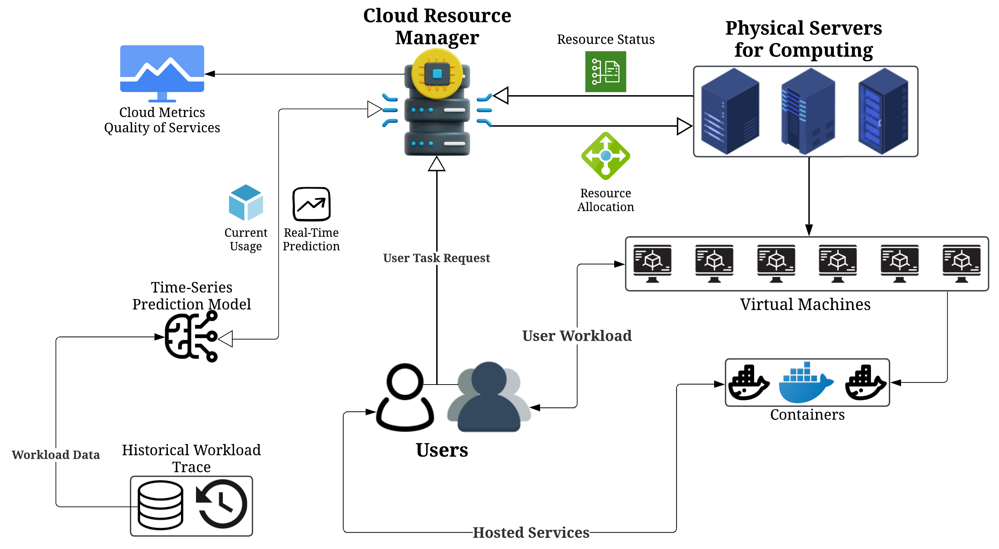

<h1 align="center">AmazonAICloud: proactive resource allocation using amazon chronos based time series model for sustainable cloud computing</h1>

## Abstract
Efficient cloud resource allocation is critical for optimising cloud computing services in terms of minimising operational costs and improving energy efficiency. The increasing demand for cloud services results in considerable energy consumption. In order to improve cloud sustainability and reduce energy consumption, the latest Artificial intelligence (AI) techniques, such as deep learning, can be applied to accurately predict resource utilisation, thereby optimising cloud performance. This paper introduces a novel framework, AmazonAICloud, that integrates Amazon Chronos, a time-series forecasting model, to forecast CPU utilisation and enhance resource allocation in cloud computing environments. The AmazonAICloud framework utilises a real-world cloud dataset that contains 1750 VM traces from BitBrains. We implement the Chronos model on Amazon web services (AWS) SageMaker and evaluate its performance against the baseline models like Autoregressive integrated moving average (ARIMA), Long Short-term memory (LSTM), and DeepAR using various machine learning-based evaluation metrics. Finally, the experimental results show that the Amazon Chronos model outperforms the baseline models in terms of CPU usage prediction, allowing for effective resource provisioning to reduce operational costs and energy consumption.

<div align="center">
    
</div>

## Cite this work
Our work is published in Springer Nature Computing, cite using the following bibtex entry:
```bibtex
@article{AmazonAICloud,
	title = {{AmazonAICloud}: proactive resource allocation using amazon chronos based time series model for sustainable cloud computing},
	volume = {107},
	doi = {10.1007/s00607-025-01435-w},
	number = {3},
	journal = {Computing},
	author = {Wang, Han and Mathews, Kevin Joji and Golec, Muhammed and Gill, Sukhpal Singh and Uhlig, Steve},
	month = mar,
	year = {2025},
	pages = {77}}
```
## License
This project is licensed under the MIT License - see the [LICENSE](LICENSE.txt) file for details.

